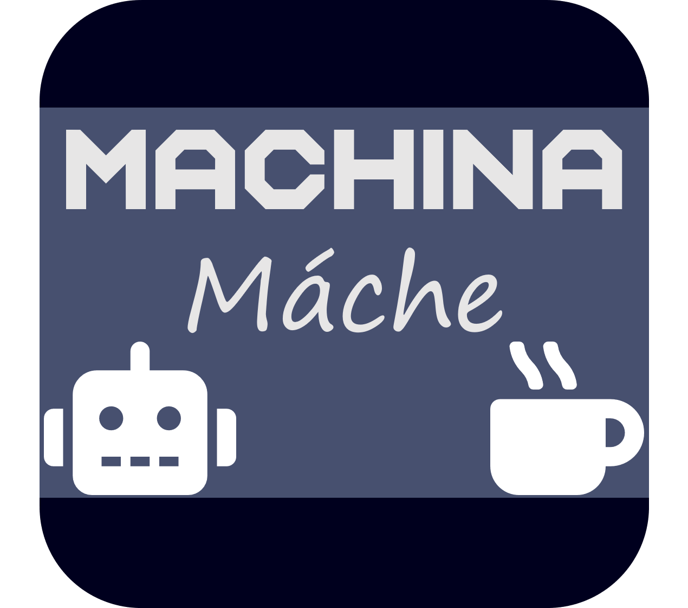

# Machina Máche

## Problem Statement
We were originally tasked with tackling the problem of data dignity by creating a product or system that helped users to maintain control of their data. Currently, companies mostly have free reign over peoples data that they easily collect and can predict from our actions on thier platforms. Many people today have surrendered to the fact that companies have data on us and are using it for thier own economic gain, with no benefits to us.

We aim to create a product that will allow people to better understand what thier data is being used for and where it ends up. Our main goal is to de-stigmatize Big Data and provide ethical avenues for companies/researchers to collect data. Through brainstorming ideas and multiple interviews with potential users, we created Machina Máche.

## Project Description
We have designed two platforms for both of our different user bases. A desktop webstite for companies looking for a ethical way to obtain data where they can create requests for data. We also created a mobile app for ordinary people to fulfill requests and potentially get compensated for their efforts.

## Context
This project was created as a part of the User Experience Design course at Seattle University, offered Spring Quarter 2019 through the Computer Science department.

Our group ended up on this idea after reading about an idea similar to ours in a paper called *A Blueprint for a Better Digital Society* by Jaron Lanier and E. Glen Weyl. We all agreed how companies obtained data from users is in a morally gray area and we wanted to find a better way for comapies to obtain data from users, without bascially stealing it from them. Thus we began creating Machina Máche.

## Group Members
- Jack Arnold: arnoldj1@seattleu.edu
- Mitchel Downey: downeym1@seattleu.edu
- Grant Ludwig: ludwigg@seattleu.edu

# Design Process
## Interview Findings

## Design Sketches

## Information Architecture

## User Task Flows

## Paper Prototypes

## Findings from User Evaluations

## Annotated Wireframes

## High-fidelity Mock-ups
### Interactive mock-ups
- [App Mockup](https://pr.to/NG1HA6/)
- [Desktop Mockup](LINK HERE)
